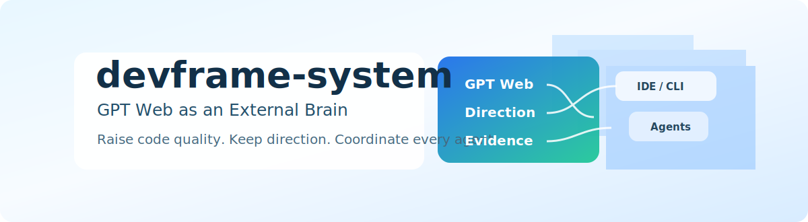

<p align="center">
  
</p>

<h3 align="center">Use GPT Web as an external brain to raise code quality and keep engineering direction on track.</h3>

<p align="center">
  <a href="#english">English</a> | <a href="#中文">简体中文</a>
</p>

<p align="center">
  
  
  
  
  
</p>

**真正的问题不是“怎样再做一套治理框架”，而是：怎样在不增加预算、不替换工具链、不训练新模型的情况下，最简单、最直接地提升代码质量，并持续把住产品与工程方向？**

**devframe-system 的答案，是把几乎免费的 GPT 网页版变成软件研发的外置大脑：GPT 负责理解目标、拆解任务、记忆上下文、校准方向、调度 agent、审查证据和沉淀经验；IDE、CLI、浏览器、自动化脚本、测试框架以及不同厂商的 coding agent 都作为可替换执行器接入。**

**The real question is not how to build another governance framework. It is how to improve code quality and direction control with the least cost, the fewest new tools, and the most direct workflow. devframe-system answers by turning the low-cost GPT web app into an external brain for software development while every IDE, CLI, browser, script, test runner, and coding agent becomes an interchangeable executor.**

---

## Table of Contents / 目录

- [English](#english)
  - [What is devframe-system?](#what-is-devframe-system)
  - [Architecture Overview](#architecture-overview)
  - [Core Components](#core-components)
  - [Getting Started](#getting-started)
  - [How to Use This Repository](#how-to-use-this-repository)
  - [Using the Governance Framework in Your Project](#using-the-governance-framework-in-your-project)
- [中文](#中文)
  - [devframe-system 是什么？](#devframe-system-是什么)
  - [架构概览](#架构概览)
  - [核心组件](#核心组件)
  - [快速上手](#快速上手)
  - [具体使用方式](#具体使用方式)
  - [在你自己的项目中使用治理框架](#在你自己的项目中使用治理框架)
- [Current Delivery / 当前交付物](#current-delivery--当前交付物)
- [Submodules / 子模块](#submodules--子模块)

---

# English

## What is devframe-system?

devframe-system is a **GPT-web-centered software quality system**. It starts
from a practical promise: use the GPT web app you already have as an external
brain, then connect it to the software, repositories, CLIs, browsers, scripts,
test runners, and coding agents you already use.

The goal is direct and concrete:

- improve code quality without buying a new platform;
- keep product and engineering direction visible before agents drift;
- make every agent action reviewable through evidence, not trust;
- turn repeated lessons into reusable operating memory.

The governance pieces are not the main attraction. They are the control surface
that lets the external brain work safely across many tools:

**1. Direction Control** — GPT web keeps the problem, product intent, tradeoffs,
and current context in view before code is written.

**2. Agent Dispatch** — TaskSpec and SADP turn vague requests into bounded work
for Codex, Claude Code, CLI scripts, browser automation, or other executors.

**3. Quality Verification** — ExecutionReport, evidence indexes, review gates,
and negative tests make code quality measurable instead of rhetorical.

**4. Portable Bootstrap** — Rules, contracts, verification docs, and templates
can be deployed into another repository with one PowerShell command.

### Design Philosophy

The system is built on several core principles:

- **Evidence-Based Governance**: Every claim must have evidence. Every gate must
  produce an explicit result. Every change must be verifiable via pre/post git
  status. "No fake green" (reporting failures as passes) is a P0 hard stop.

- **Separation of Execution and Approval**: The plan agent plans, the execute
  agent implements, the reviewer reviews, the finalizer summarizes. No agent can
  approve its own work — this is enforced structurally, not by trust.

- **Reuse Before Build (Gate 0)**: Before creating anything new, agents must
  prove that existing resources do not already cover the need, preventing
  redundant construction.

- **Defense in Depth**: 40 runtime invariants, 46 rules, 30 negative test
  fixtures, 4-level verification gates, strict phase boundaries, and forbidden
  action lists create overlapping protection layers.

- **Phase-Gated Evolution**: Phase 0-5 (current) is intentionally restrictive —
  almost everything is read-only. Capabilities are progressively unlocked through
  reviewer approval.

- **Knowledge Metabolism**: Operational knowledge flows through a 3-tier
  lifecycle (Incident → Pattern → Principle) with promotion/demotion criteria,
  preventing both knowledge loss and rule inflation (P0 rules capped at 7).

## Architecture Overview

```
┌─────────────────────────────────────────────────────────┐
│                  devframe-system (Superproject)          │
│                                                         │
│  ┌─────────────┐  ┌──────────────┐  ┌──────────────┐  │
│  │   rules/    │  │   schemas/   │  │    docs/     │  │
│  │  46 rules   │  │ 54+ JSON     │  │  agent-      │  │
│  │  7 domains  │  │  Schemas     │  │  runtime/    │  │
│  └─────────────┘  └──────────────┘  └──────────────┘  │
│                                                         │
│  ┌─────────────────────────────────────────────────┐   │
│  │     templates/runtime-bootstrap/bootstrap.ps1    │   │
│  │     One-command deployment to any project        │   │
│  └─────────────────────────────────────────────────┘   │
│                                                         │
│  ┌─────────────────────────────────────────────────┐   │
│  │           Sub-Agent Dispatch Protocol            │   │
│  │                                                  │   │
│  │  [Codex Goal Agent] ←──TaskSpec──→ [Claude Code]│   │
│  │        ↑                                    │    │   │
│  │        └────ExecutionReport + Evidence──────┘    │   │
│  │                     ↓                            │   │
│  │              [Human Reviewer]                    │   │
│  └─────────────────────────────────────────────────┘   │
│                                                         │
│  ┌──────────────────┐  ┌──────────────────────────┐   │
│  │ agent-acceptance │  │ devframe-control-plane   │   │
│  │ (Governance/     │  │ (Control-plane runtime   │   │
│  │  SADP gates)     │  │  candidate, frozen)      │   │
│  ├──────────────────┤  ├──────────────────────────┤   │
│  │ dev-frame-       │  │ test-frame               │   │
│  │ opencode         │  │ (Verification runtime    │   │
│  │ (Workflow/       │  │  & test orchestration)   │   │
│  │  RAG pipeline)   │  │                          │   │
│  └──────────────────┘  └──────────────────────────┘   │
└─────────────────────────────────────────────────────────┘
```

### Execution Layers

| Layer | Scope | Trigger |
|-------|-------|---------|
| L0: Smoke | 7 basic health checks | Session start, config change |
| L1: Batch | Per-task quality batch | Per-commit, per-PR |
| L2: WorkQueue | Tier-graded queue execution | Scheduled, pre-release |
| L3: Parallel | Controlled parallel queues | When throughput needed |

### Verification Gate Hierarchy

| Level | Name | Failure Result | Description |
|-------|------|---------------|-------------|
| P0 | Security | BLOCKED | Secrets, injection, traversal, thread safety — must pass |
| P1 | Correctness | FAILED | Build, tests, exit codes, no regression — must pass |
| P2 | Quality | WARNING | Code review, lint, performance — should pass |
| P3 | Completeness | INFO | Documentation, coverage, error handling — nice to have |

Gates execute in strict order: P0 → P1 → P2 → P3. P0 failures can never be
bypassed.

### Exit Code Contract

| Code | Label | Meaning |
|------|-------|---------|
| 0 | PASS | All checks passed |
| 1 | BLOCKED | Cannot proceed (missing dependency, env issue) |
| 2 | FAILED | Check failed, must fix |

## Core Components

### 1. Rules System (46 rules, 7 domains)

| Domain | Rules | Key Focus |
|--------|-------|-----------|
| `rules/core.md` | 8 | Git safety, secrets, phase boundaries, resource reuse |
| `rules/coding.md` | 7 | Error handling, minimal changes, read-before-edit |
| `rules/security.md` | 8 | No secrets, no injection, input validation, encryption |
| `rules/review.md` | 6 | No fake green, evidence chains, reviewer separation |
| `rules/git.md` | 6 | No force push, no destructive ops, clean commits |
| `rules/research.md` | 5 | No secrets in research, verify before acting |
| `rules/frontend.md` | 6 | No XSS, component isolation, responsive, accessible |

### 2. Integration Contracts (8 core contracts)

| Contract | Purpose |
|----------|---------|
| **TaskSpec** | Describes a unit of work before execution |
| **RunSpec** | Records how a task was executed |
| **EvidenceIndex** | Index of evidence artifacts produced |
| **GateResult** | Result of a single verification gate check |
| **ExecutionReport** | Final structured report of batch execution |
| **SkillIntakeRecord** | Records intake evaluation of external skills |
| **ToolRiskRecord** | Records risk assessment of tools |
| **MemoryUpdateRecord** | Proposed memory updates (human-approved) |

### 3. Sub-Agent Dispatch Protocol (SADP)

SADP is the default development workflow for multi-agent collaboration:

```
User triggers @go
    ↓
Gate 0: Resource Sufficiency Check (prove gap before action)
    ↓
Codex Goal Agent: Decomposes goal → TaskSpecs
    ↓
Claude Code Agent: Receives TaskSpec → Executes → Produces ExecutionReport
    ↓
Reviewer (separate identity): Validates evidence → Issues verdict
    ↓
Finalizer: Packages artifacts → Deterministic summary
```

**Mandatory Reviewer Node**: Every run that changes files must pass through:
`human_gate → executor/fixer → tester → reviewer → finalizer`. The executor
may implement and report, but cannot approve its own work.

**Conflict Registry**: Each TaskSpec declares file access scope (read_set,
write_set) for safe parallel dispatch. Protected files require exclusive locks.

**Fallback Matrix**: When dispatch fails, fallback is classified by risk level.
Silent fallback is forbidden at all levels.

### 4. Runtime Invariants (40 invariants, 18 categories)

Key invariant groups include: source-of-truth integrity, approved output
containment, pre/post git status requirements, fake-green prevention, phase
boundary enforcement, memory write protection, secret isolation, dangerous git
operation blocking, executor self-approval prevention, command injection
blocking, path traversal blocking, and input validation.

### 5. Bootstrap System

The entire governance framework can be deployed to any project with a single
PowerShell command. See [Using the Governance Framework in Your
Project](#using-the-governance-framework-in-your-project).

### 6. Negative Acceptance Tests

30 negative test fixtures (NEG-001 through NEG-030) simulate reports with
deliberate violations that the reviewer must catch. Distribution: 22 blocked
(P0 hard stops), 6 fail, 2 warning. Coverage spans all review rules, gate
levels, core contracts, and forbidden tool categories.

### 7. Knowledge Metabolism (Lessons Learned)

10 operational lessons captured through a 3-tier lifecycle:

- **Tier 3 (Incident)**: Specific event. 3 incidents promote to pattern.
- **Tier 2 (Pattern)**: Recurring failure type. 3 validations promote to
  principle.
- **Tier 1 (Principle)**: Stable rule with P0/P1 enforcement. 3+ false
  positives trigger downgrade.

## Getting Started

### Prerequisites

- Git (with submodule support)
- PowerShell 5.1+ (Windows) or pwsh (cross-platform)
- Python 3.8+ (for verification scripts)

### Clone and Initialize

```powershell
git clone --recurse-submodules https://github.com/RD2100/devframe-system.git
cd devframe-system
git submodule status --recursive
```

### Verify the Repository

```powershell
# Check submodule status
git submodule status --recursive

# Check working tree is clean
git status --porcelain=v1 -uall

# Check for whitespace/formatting issues
git diff --check
```

### Run Current Delivery Verification

```powershell
# Core handoff verification
python scripts\verify_local_paper_rag_v1_0_handoff.py --root D:\devframe-system
python scripts\verify_local_paper_rag_final_review_v1_1.py --root D:\devframe-system

# Submission-prep verification
python scripts\verify_local_paper_rag_submission_prep_v1_0.py --root D:\devframe-system

# Review-variants verification
python scripts\verify_local_paper_rag_review_variants_v1_0.py --root D:\devframe-system

# Submission-candidate verification
python scripts\verify_local_paper_rag_submission_candidate_v1_2.py --root D:\devframe-system
```

### Explore the Governance Framework

Read the core documentation in order:

1. `docs/agent-runtime/operating-model.md` — Execution layers, tiers, lifecycle
2. `docs/agent-runtime/integration-contracts.md` — 8 core data contracts
3. `docs/agent-runtime/verification-gates.md` — P0-P3 gate hierarchy
4. `docs/agent-runtime/sub-agent-dispatch-protocol.md` — SADP workflow
5. `docs/agent-runtime/reviewer-playbook.md` — 10-step deterministic review
6. `docs/agent-runtime/lessons-learned.md` — Operational knowledge

Read the rules:

- `rules/core.md` — 8 foundational rules (including the P0 hard stops)
- `rules/security.md` — 8 security rules
- `rules/coding.md` — 7 coding rules
- `rules/review.md` — 6 review rules

## How to Use This Repository

Use devframe-system as both a **reference implementation** and a **portable
runtime kit**. The most common workflows are:

### 1. Understand the System Before Running Anything

Start from the lightweight entry points:

1. `README.md` — project overview, architecture, and usage map.
2. `AGENTS.md` — active project-local operating instructions and hard stops.
3. `RUNBOOK.md` — safe read-only health checks and phase boundaries.
4. `CURRENT_DELIVERY.md` — current reviewer-facing deliverables and their
   verification commands.

In Phase 0-5, treat the repository as a governance baseline. Prefer read-only
inspection, evidence review, and dry runs. Do not push, commit, reset, stash,
install packages, change MCP configuration, or run live external capabilities
without explicit human authorization.

### 2. Audit the Current Superproject State

Run these checks from the repository root when you need a quick safety snapshot:

```powershell
git status --short --branch
git submodule status --recursive
git diff --check
```

For a fuller read-only inventory, follow `RUNBOOK.md`. The runbook lists the
expected outputs, current phase gates, active TaskSpecs, and human-gate triggers.

### 3. Review a Current Delivery Package

Use `CURRENT_DELIVERY.md` as the active handoff index. It tells reviewers which
artifact package to open first, which hashes to verify, which scripts correspond
to the current delivery, and which claims are intentionally out of scope.

Typical review flow:

1. Confirm the package path and SHA256 in `CURRENT_DELIVERY.md`.
2. Run only the listed verification command for that package.
3. Compare produced evidence with the supporting reports under
   `integration/reports/`.
4. Record the verdict as `pass`, `failed`, `blocked`, or `human_required`; never
   turn a failed or blocked check into a pass.

### 4. Use SADP for Multi-Agent Work

For delegated work, follow the Sub-Agent Dispatch Protocol instead of sending
free-form instructions:

1. The goal agent writes a TaskSpec with scope, allowed files, forbidden files,
   verification commands, rollback plan, and hard-stop rules.
2. The executor implements only the TaskSpec scope and returns an ExecutionReport.
3. A separate reviewer validates evidence, changed files, test output, and risk.
4. A finalizer packages the accepted state and points to exact artifacts.

The core contract files are:

- `docs/agent-runtime/sub-agent-dispatch-protocol.md`
- `docs/agent-runtime/integration-contracts.md`
- `docs/agent-runtime/reviewer-playbook.md`
- `integration/task-specs/`
- `integration/reports/`

### 5. Bootstrap the Governance Kit into Another Project

Use `templates/runtime-bootstrap/bootstrap.ps1` when another repository needs the
same governance framework. Always dry-run first:

```powershell
cd templates\runtime-bootstrap
.\bootstrap.ps1 -ProjectName "my-project" -ProjectRoot "D:\my-project" -DryRun
.\bootstrap.ps1 -ProjectName "my-project" -ProjectRoot "D:\my-project"
```

The bootstrap copies the rules, schemas, agent-runtime documentation, negative
fixtures, and generated project-local files. After bootstrap, the target project
gets its own `AGENTS.md`, capability inventory, tool policy, and governance
manifest.

### 6. Extend the Framework Safely

When adding a new rule, contract, verifier, or capability:

1. Check `docs/agent-runtime/capability-inventory.md` first; new capabilities
   need inventory registration and reviewer approval before use.
2. Keep the change in the smallest relevant area: `rules/`, `schemas/`,
   `docs/agent-runtime/`, `templates/`, or `integration/`.
3. Add or update evidence under `integration/reports/` when the change affects
   review, verification, or delivery claims.
4. Run the narrowest read-only checks that prove the new material is internally
   consistent.

### 7. Know When to Stop

Stop and ask for human approval before any action involving production data,
secrets, live external services, runtime pilots, package installation, git
mutation, deployment, MCP configuration, or broad repository rewrites. These are
not etiquette rules; they are part of the repository's P0 safety boundary.

## Using the Governance Framework in Your Project

The bootstrap system deploys the full RD2100 Agent Runtime governance framework
(rules, schemas, documentation, verification infrastructure) to any project with
a single command.

### Quick Start

```powershell
# From the devframe-system repository
cd templates\runtime-bootstrap

# Deploy to your project (dry run first)
.\bootstrap.ps1 -ProjectName "my-project" -ProjectRoot "D:\my-project" -DryRun

# Actual deployment
.\bootstrap.ps1 -ProjectName "my-project" -ProjectRoot "D:\my-project"
```

### Parameters

| Parameter | Default | Description |
|-----------|---------|-------------|
| `-ProjectName` | Auto-detected | Project name (from directory or git remote) |
| `-ProjectRoot` | Current directory | Target project root |
| `-Platform` | `Both` | Target platform: `Claude`, `Codex`, or `Both` |
| `-Phase` | `0-5` | Phase designation |
| `-DryRun` | Off | Preview without writing files |
| `-Force` | Off | Overwrite existing files |

### What Gets Deployed

**Step 1 — Universal Assets:**

- 8 rule files (46 rules across 7 domains)
- 54+ JSON Schema files for contract validation
- 12+ agent-runtime documentation files
- 30 negative test fixtures
- Bootstrap templates for re-bootstrapping

**Step 2 — Project-Specific Files (generated from templates):**

- `AGENTS.md` — Agent entry point with Quick Start, Hard Stops, Document Map
- `docs/agent-runtime/capability-inventory.md` — Capability registry
- `docs/agent-runtime/tool-policy.md` — Phase-aware tool policy
- `docs/agent-runtime/governance-manifest.md` — Integrity manifest with SHA256
  hashes

**Step 3 — Verification:**

- Validates no unresolved placeholders remain
- Confirms capability inventory is properly initialized

### After Bootstrap

After running bootstrap, your project will have:

```
your-project/
├── AGENTS.md                          ← Agent entry point
├── rules/                             ← 8 rule files
├── schemas/                           ← JSON Schema validation
├── docs/agent-runtime/                ← Full governance documentation
│   ├── operating-model.md
│   ├── integration-contracts.md
│   ├── verification-gates.md
│   ├── sub-agent-dispatch-protocol.md
│   ├── reviewer-playbook.md
│   ├── capability-inventory.md
│   ├── tool-policy.md
│   ├── governance-manifest.md
│   ├── lessons-learned.md
│   └── negative-test-fixtures/        ← 30 JSON fixtures
└── templates/runtime-bootstrap/       ← For re-bootstrapping
```

---

# 中文

## devframe-system 是什么？

devframe-system 是一个**以 GPT 网页版为中心的软件质量提升系统**。它先解决最现实的问题：不新增预算、不替换工具链、不训练新模型，只把你已经在用的 GPT 网页版变成外置大脑，再接入你已经在用的软件、仓库、CLI、浏览器、脚本、测试框架和 coding agent。

它追求的是非常直接的结果：

- 不买新平台，也能提升代码质量；
- 在 agent 开始跑偏前，把产品方向和工程方向拉回视野；
- 让每一次 agent 行动都能靠证据审查，而不是靠信任；
- 把反复踩坑的经验沉淀成可复用的操作记忆。

规则、契约和门禁不是主卖点，而是让这个外置大脑可以安全连接多软件、多 agent 的控制面：

**1. 方向把控** — GPT 网页版在写代码之前持续保留问题、产品意图、取舍和当前上下文。

**2. Agent 调度** — TaskSpec 和 SADP 把模糊需求变成有边界的任务，交给 Codex、Claude Code、CLI 脚本、浏览器自动化或其他执行器。

**3. 质量验证** — ExecutionReport、证据索引、审查门禁和负面测试让代码质量变成可以检查的东西，而不是一句“看起来没问题”。

**4. 可迁移引导** — 规则、契约、验证文档和模板可以通过一条 PowerShell 命令部署到其他仓库。

### 设计理念

系统建立在几个核心原则之上：

- **基于证据的治理**：每一个声明都必须有证据支撑。每一个门禁都必须产出明确的结果。每一个变更都必须可以通过执行前后的 git 状态来验证。"假绿"（将失败报告为通过）是 P0 级硬停止。

- **执行与审批分离**：规划智能体负责规划，执行智能体负责实施，审查者负责审查，终结者负责汇总。任何智能体都不能审批自己的工作——这是结构性强制的，而非依赖信任。

- **先复用再构建（Gate 0）**：在创建任何新内容之前，智能体必须证明现有资源无法满足需求，防止冗余构建。

- **纵深防御**：40 条运行时不变量、46 条规则、30 个负面测试夹具、4 级验证门禁、严格的阶段边界和禁止操作列表，形成多重叠加的保护层。

- **阶段门控演进**：Phase 0-5（当前阶段）是有意设置的严格限制阶段——几乎所有操作都是只读的。能力通过审查者批准后逐步解锁。

- **知识代谢**：运维知识通过 3 层生命周期流转（事件 → 模式 → 原则），配有晋升/降级标准，防止知识流失和规则膨胀（P0 规则上限 7 条）。

## 架构概览

```
┌─────────────────────────────────────────────────────────┐
│               devframe-system（超级项目）                 │
│                                                         │
│  ┌─────────────┐  ┌──────────────┐  ┌──────────────┐  │
│  │   rules/    │  │   schemas/   │  │    docs/     │  │
│  │  46 条规则   │  │ 54+ JSON     │  │  agent-      │  │
│  │  7 个领域    │  │  Schema      │  │  runtime/    │  │
│  └─────────────┘  └──────────────┘  └──────────────┘  │
│                                                         │
│  ┌─────────────────────────────────────────────────┐   │
│  │     templates/runtime-bootstrap/bootstrap.ps1    │   │
│  │     一条命令部署到任何项目                          │   │
│  └─────────────────────────────────────────────────┘   │
│                                                         │
│  ┌─────────────────────────────────────────────────┐   │
│  │           子智能体调度协议 (SADP)                  │   │
│  │                                                  │   │
│  │  [Codex 目标智能体] ←──TaskSpec──→ [Claude Code] │   │
│  │        ↑                                    │    │   │
│  │        └────ExecutionReport + 证据──────────┘    │   │
│  │                     ↓                            │   │
│  │              [人类审查者]                          │   │
│  └─────────────────────────────────────────────────┘   │
│                                                         │
│  ┌──────────────────┐  ┌──────────────────────────┐   │
│  │ agent-acceptance │  │ devframe-control-plane   │   │
│  │（治理与验收框架）  │  │（控制平面运行时候选，已冻结）│   │
│  ├──────────────────┤  ├──────────────────────────┤   │
│  │ dev-frame-       │  │ test-frame               │   │
│  │ opencode         │  │（验证运行时与测试编排）      │   │
│  │（工作流/         │  │                          │   │
│  │  RAG 管线）       │  │                          │   │
│  └──────────────────┘  └──────────────────────────┘   │
└─────────────────────────────────────────────────────────┘
```

### 执行层次

| 层 | 范围 | 触发条件 |
|----|------|---------|
| L0: 冒烟测试 | 7 项基本健康检查 | 会话启动、配置变更 |
| L1: 批次 | 每任务质量批次 | 每次提交、每个 PR |
| L2: 工作队列 | 分级队列执行 | 定时任务、发布前 |
| L3: 并行 | 受控并行队列 | 需要提高吞吐量时 |

### 验证门禁体系

| 级别 | 名称 | 失败结果 | 描述 |
|------|------|---------|------|
| P0 | 安全性 | BLOCKED | 密钥、注入、路径遍历、线程安全——必须通过 |
| P1 | 正确性 | FAILED | 构建、测试、退出码、无回归——必须通过 |
| P2 | 质量 | WARNING | 代码审查、Lint、性能——应当通过 |
| P3 | 完整性 | INFO | 文档、覆盖率、错误处理——最好通过 |

门禁严格按顺序执行：P0 → P1 → P2 → P3。P0 失败永远不能被绕过。

### 退出码契约

| 代码 | 标签 | 含义 |
|------|------|------|
| 0 | PASS | 所有检查通过 |
| 1 | BLOCKED | 无法继续（缺少依赖、环境问题） |
| 2 | FAILED | 检查失败，必须修复 |

## 核心组件

### 1. 规则系统（46 条规则，7 个领域）

| 领域 | 规则数 | 核心关注点 |
|------|--------|-----------|
| `rules/core.md` | 8 | Git 安全、密钥、阶段边界、资源复用 |
| `rules/coding.md` | 7 | 错误处理、最小变更、先读后改 |
| `rules/security.md` | 8 | 无密钥、无注入、输入验证、加密 |
| `rules/review.md` | 6 | 无假绿、证据链、审查者分离 |
| `rules/git.md` | 6 | 禁止强推、禁止破坏性操作、干净提交 |
| `rules/research.md` | 5 | 研究中无密钥、行动前先验证 |
| `rules/frontend.md` | 6 | 无 XSS、组件隔离、响应式、可访问性 |

### 2. 集成契约（8 个核心契约）

| 契约 | 用途 |
|------|------|
| **TaskSpec** | 执行前描述一个工作单元 |
| **RunSpec** | 记录任务的执行方式 |
| **EvidenceIndex** | 产出的证据制品索引 |
| **GateResult** | 单个验证门禁的检查结果 |
| **ExecutionReport** | 批次执行的最终结构化报告 |
| **SkillIntakeRecord** | 记录外部技能的接收评估 |
| **ToolRiskRecord** | 记录工具的风险评估 |
| **MemoryUpdateRecord** | 提议的记忆更新（需人类批准） |

### 3. 子智能体调度协议（SADP）

SADP 是多智能体协作的默认开发工作流：

```
用户触发 @go
    ↓
Gate 0: 资源充足性检查（行动前证明缺口）
    ↓
Codex 目标智能体: 分解目标 → TaskSpec
    ↓
Claude Code 执行智能体: 接收 TaskSpec → 执行 → 产出 ExecutionReport
    ↓
审查者（独立身份）: 验证证据 → 发布裁决
    ↓
终结者: 打包制品 → 确定性汇总
```

**强制审查者节点**: 每次变更文件的运行必须经过：`human_gate →
executor/fixer → tester → reviewer → finalizer`。执行者可以实施和报告，
但不能审批自己的工作。

**冲突注册表**: 每个 TaskSpec 声明文件访问范围（read_set, write_set），
以实现安全的并行调度。受保护的文件需要独占锁。

**降级矩阵**: 当调度失败时，按风险等级分类降级方案。
所有级别均禁止静默降级。

### 4. 运行时不变量（40 条不变量，18 个类别）

关键不变量组包括：真实来源完整性、批准输出范围控制、执行前后 git 状态要求、假绿防护、阶段边界执行、记忆写入保护、密钥隔离、危险 git 操作阻断、执行者自我审批防护、命令注入阻断、路径遍历阻断和输入验证。

### 5. 引导部署系统

整个治理框架可以通过一条 PowerShell 命令部署到任何项目。详见[在你自己的项目中使用治理框架](#在你自己的项目中使用治理框架)。

### 6. 负面验收测试

30 个负面测试夹具（NEG-001 到 NEG-030）模拟包含故意违规的报告，审查者必须识别。分布：22 个 blocked（P0 硬停止）、6 个 fail、2 个 warning。覆盖所有审查规则、门禁级别、核心契约和禁止工具类别。

### 7. 知识代谢（经验教训）

通过 3 层生命周期捕获的 10 条运维经验：

- **第 3 层（事件）**：特定事件。3 次事件可晋升为模式。
- **第 2 层（模式）**：反复出现的故障类型。3 次验证可晋升为原则。
- **第 1 层（原则）**：稳定的 P0/P1 强制执行规则。3 次以上误报触发降级。

## 快速上手

### 前置要求

- Git（支持子模块）
- PowerShell 5.1+（Windows）或 pwsh（跨平台）
- Python 3.8+（用于验证脚本）

### 克隆并初始化

```powershell
git clone --recurse-submodules https://github.com/RD2100/devframe-system.git
cd devframe-system
git submodule status --recursive
```

### 验证仓库

```powershell
# 检查子模块状态
git submodule status --recursive

# 检查工作树是否干净
git status --porcelain=v1 -uall

# 检查空格/格式问题
git diff --check
```

### 运行当前交付物验证

```powershell
# 核心交接验证
python scripts\verify_local_paper_rag_v1_0_handoff.py --root D:\devframe-system
python scripts\verify_local_paper_rag_final_review_v1_1.py --root D:\devframe-system

# 投稿准备验证
python scripts\verify_local_paper_rag_submission_prep_v1_0.py --root D:\devframe-system

# 审稿变体验证
python scripts\verify_local_paper_rag_review_variants_v1_0.py --root D:\devframe-system

# 投稿候选验证
python scripts\verify_local_paper_rag_submission_candidate_v1_2.py --root D:\devframe-system
```

### 探索治理框架

按顺序阅读核心文档：

1. `docs/agent-runtime/operating-model.md` — 执行层次、分级、生命周期
2. `docs/agent-runtime/integration-contracts.md` — 8 个核心数据契约
3. `docs/agent-runtime/verification-gates.md` — P0-P3 门禁体系
4. `docs/agent-runtime/sub-agent-dispatch-protocol.md` — SADP 工作流
5. `docs/agent-runtime/reviewer-playbook.md` — 10 步确定性审查流程
6. `docs/agent-runtime/lessons-learned.md` — 运维知识库

阅读规则：

- `rules/core.md` — 8 条基础规则（包括 P0 硬停止）
- `rules/security.md` — 8 条安全规则
- `rules/coding.md` — 7 条编码规则
- `rules/review.md` — 6 条审查规则

## 具体使用方式

devframe-system 既可以作为 **治理框架参考实现**，也可以作为 **可迁移的运行时治理套件**。最常见的使用路径如下：

### 1. 先理解系统，再执行命令

建议从这些轻量入口开始：

1. `README.md` — 项目概览、架构和使用地图。
2. `AGENTS.md` — 当前项目本地运行规则和硬停止。
3. `RUNBOOK.md` — 安全的只读健康检查和阶段边界。
4. `CURRENT_DELIVERY.md` — 当前面向审查者的交付物、哈希和验证命令。

当前 Phase 0-5 应把仓库视为治理基线。优先做只读检查、证据审查和 dry run。没有明确人工授权时，不要 push、commit、reset、stash、安装包、修改 MCP 配置，也不要运行 live 外部能力。

### 2. 审计当前超级项目状态

需要快速确认仓库安全状态时，在根目录运行：

```powershell
git status --short --branch
git submodule status --recursive
git diff --check
```

如果需要更完整的只读盘点，按 `RUNBOOK.md` 执行。Runbook 会列出预期输出、当前阶段门禁、活跃 TaskSpec 和必须触发人工门禁的动作。

### 3. 审查当前交付包

`CURRENT_DELIVERY.md` 是当前交付入口。它说明审查者应该先打开哪个 artifact package、校验哪个 SHA256、运行哪些验证脚本，以及哪些结论仍然不在本次交付范围内。

典型审查流程：

1. 确认 `CURRENT_DELIVERY.md` 中的包路径和 SHA256。
2. 只运行该交付物列出的验证命令。
3. 将生成的证据与 `integration/reports/` 下的支持报告交叉核对。
4. 将结论记录为 `pass`、`failed`、`blocked` 或 `human_required`；失败或阻塞不能被包装成通过。

### 4. 用 SADP 管理多智能体协作

涉及派发或多智能体执行时，不要直接发送开放式指令，而是走 Sub-Agent Dispatch Protocol：

1. Goal Agent 写 TaskSpec，明确范围、允许文件、禁止文件、验证命令、回滚方案和硬停止。
2. Executor 只在 TaskSpec 范围内实现，并返回 ExecutionReport。
3. 独立 Reviewer 校验证据、改动文件、测试输出和风险。
4. Finalizer 打包已接受状态，并指向精确 artifact 路径。

核心契约文件：

- `docs/agent-runtime/sub-agent-dispatch-protocol.md`
- `docs/agent-runtime/integration-contracts.md`
- `docs/agent-runtime/reviewer-playbook.md`
- `integration/task-specs/`
- `integration/reports/`

### 5. 把治理套件引导到另一个项目

当其他仓库需要同一套治理框架时，使用 `templates/runtime-bootstrap/bootstrap.ps1`。务必先 dry run：

```powershell
cd templates\runtime-bootstrap
.\bootstrap.ps1 -ProjectName "my-project" -ProjectRoot "D:\my-project" -DryRun
.\bootstrap.ps1 -ProjectName "my-project" -ProjectRoot "D:\my-project"
```

Bootstrap 会复制规则、Schema、agent-runtime 文档、负面测试夹具和项目本地生成文件。完成后，目标项目会得到自己的 `AGENTS.md`、能力清单、工具策略和治理清单。

### 6. 安全扩展框架

新增规则、契约、验证器或能力时：

1. 先检查 `docs/agent-runtime/capability-inventory.md`；新能力必须注册并通过审查后才能启用。
2. 将改动限制在最小相关区域：`rules/`、`schemas/`、`docs/agent-runtime/`、`templates/` 或 `integration/`。
3. 如果改动影响审查、验证或交付结论，在 `integration/reports/` 下补充或更新证据。
4. 运行最窄的只读检查，证明新增内容内部一致。

### 7. 什么时候必须停止

任何涉及生产数据、密钥、live 外部服务、runtime pilot、安装依赖、git 变更、部署、MCP 配置或大范围重写的动作，都必须先停下并请求人工批准。这不是礼貌约定，而是仓库 P0 安全边界的一部分。

## 在你自己的项目中使用治理框架

引导部署系统可以通过一条命令将完整的 RD2100 Agent Runtime 治理框架（规则、Schema、文档、验证基础设施）部署到任何项目。

### 快速开始

```powershell
# 在 devframe-system 仓库中
cd templates\runtime-bootstrap

# 部署到你的项目（先试运行）
.\bootstrap.ps1 -ProjectName "my-project" -ProjectRoot "D:\my-project" -DryRun

# 正式部署
.\bootstrap.ps1 -ProjectName "my-project" -ProjectRoot "D:\my-project"
```

### 参数说明

| 参数 | 默认值 | 描述 |
|------|--------|------|
| `-ProjectName` | 自动检测 | 项目名称（从目录或 git 远程获取） |
| `-ProjectRoot` | 当前目录 | 目标项目根目录 |
| `-Platform` | `Both` | 目标平台：`Claude`、`Codex` 或 `Both` |
| `-Phase` | `0-5` | 阶段标识 |
| `-DryRun` | 关闭 | 预览而不写入文件 |
| `-Force` | 关闭 | 覆盖现有文件 |

### 部署内容

**步骤 1 — 通用资产：**

- 8 个规则文件（7 个领域共 46 条规则）
- 54+ JSON Schema 文件用于契约验证
- 12+ 份 agent-runtime 文档
- 30 个负面测试夹具
- 引导模板（用于重新引导）

**步骤 2 — 项目特定文件（从模板生成）：**

- `AGENTS.md` — 智能体入口，包含快速开始、硬停止、文档地图
- `docs/agent-runtime/capability-inventory.md` — 能力注册表
- `docs/agent-runtime/tool-policy.md` — 阶段感知的工具策略
- `docs/agent-runtime/governance-manifest.md` — 包含 SHA256 哈希的完整性清单

**步骤 3 — 验证：**

- 验证没有未解析的占位符
- 确认能力清单已正确初始化

### 部署后的项目结构

```
your-project/
├── AGENTS.md                          ← 智能体入口
├── rules/                             ← 8 个规则文件
├── schemas/                           ← JSON Schema 验证
├── docs/agent-runtime/                ← 完整治理文档
│   ├── operating-model.md
│   ├── integration-contracts.md
│   ├── verification-gates.md
│   ├── sub-agent-dispatch-protocol.md
│   ├── reviewer-playbook.md
│   ├── capability-inventory.md
│   ├── tool-policy.md
│   ├── governance-manifest.md
│   ├── lessons-learned.md
│   └── negative-test-fixtures/        ← 30 个 JSON 夹具
└── templates/runtime-bootstrap/       ← 用于重新引导
```

---

# Current Delivery / 当前交付物

The active handoff entrypoint is: `CURRENT_DELIVERY.md`

Current reviewer-facing paper/RAG artifact:

- `integration/artifacts/paper-drafts/local-paper-rag-review-variants-v1.1-package.zip`

Recommended first DOCX:

- `integration/artifacts/paper-drafts/local-paper-rag-short-paper-v1.1.docx`

One-command verification:

```powershell
python scripts\verify_local_paper_rag_v1_0_handoff.py --root D:\devframe-system
python scripts\verify_local_paper_rag_final_review_v1_1.py --root D:\devframe-system
```

Submission-prep supplement verification:

```powershell
python scripts\verify_local_paper_rag_submission_prep_v1_0.py --root D:\devframe-system
```

Review-variants supplement verification:

```powershell
python scripts\verify_local_paper_rag_review_variants_v1_0.py --root D:\devframe-system
```

Submission-candidate supplement verification:

```powershell
python scripts\verify_local_paper_rag_submission_candidate_v1_2.py --root D:\devframe-system
```

Expected results:

```text
PASS_LOCAL_PAPER_RAG_V1_0_HANDOFF_VERIFICATION        passed=36  failed=0
PASS_LOCAL_PAPER_RAG_FINAL_REVIEW_V1_1_VERIFICATION   passed=109 failed=0
PASS_LOCAL_PAPER_RAG_REVIEW_VARIANTS_V1_0_VERIFICATION passed=79  failed=0
PASS_LOCAL_PAPER_RAG_SUBMISSION_CANDIDATE_V1_2_VERIFICATION passed=52 failed=0
```

Current optional review variants:

- Short paper:
  `integration/artifacts/paper-drafts/local-paper-rag-short-paper-v1.1.docx`
- Technical note:
  `integration/artifacts/paper-drafts/local-paper-rag-technical-note-v1.1.docx`
- Internal brief:
  `integration/artifacts/paper-drafts/local-paper-rag-internal-brief-v1.1.docx`

Generic GB/T-style submission candidate:

- `integration/artifacts/paper-drafts/local-paper-rag-submission-candidate-v1.2.docx`

This is a non-final human-review handoff. It does not claim final
paper-quality acceptance, training-effect acceptance, production readiness,
broad RAG readiness, or RuntimeAuthorization.

# Submodules / 子模块

Authoritative current pins are `integration/lock/submodules.lock.yml` plus the
Git submodule entries in the parent tree.

| Path | Role | Branch | Pinned commit |
|---|---|---|---|
| `agent-acceptance` | Governance and acceptance framework | `codex/paper-archive-final-verdict-boundary` | `2e0bd56` |
| `devframe-control-plane` | Control-plane runtime candidate | `codex/lease-source-lock-contracts` | `09167bc` |
| `dev-frame-opencode` | Opencode workflow/runtime candidate | `codex/paper-audit-privacy-hard-gate` | `528f5b8` |
| `test-frame` | Controlled verification runtime candidate | `codex/adapter-negative-matrix` | `72c3150` |

## Boundary

- Physical merge type: superproject plus submodules.
- No source squashing or monorepo copy was performed.
- No external runtime was executed during bootstrap.
- Each source repository was clean before pinning.
- `dev-frame-opencode` local tests were verified before pinning:
  `python -m pytest tests -q` → `2451 passed, 2 skipped, 3 warnings`.

## Project Structure / 项目结构

```
D:\devframe-system\
├── AGENTS.md                           ← Agent entry point (generated)
├── CURRENT_DELIVERY.md                 ← Active handoff entrypoint
├── README.md                           ← This file
├── agent-acceptance/                   ← [submodule] Governance & acceptance
├── dev-frame-opencode/                 ← [submodule] Workflow/RAG pipeline
├── devframe-control-plane/             ← [submodule] Control-plane (frozen)
├── test-frame/                         ← [submodule] Verification runtime
├── docs/
│   └── agent-runtime/                  ← Governance documentation (12+ files)
│       ├── operating-model.md
│       ├── integration-contracts.md
│       ├── verification-gates.md
│       ├── sub-agent-dispatch-protocol.md
│       ├── reviewer-playbook.md
│       ├── capability-inventory.md
│       ├── tool-policy.md
│       ├── dispatch-model-profiles.md
│       ├── lessons-learned.md
│       ├── runtime-invariants.md
│       ├── project-local-skill-bindings.md
│       ├── negative-acceptance-tests.md
│       └── negative-test-fixtures/     ← 30 JSON negative test fixtures
├── rules/                              ← Rule system (46 rules, 7 domains)
│   ├── README.md
│   ├── core.md
│   ├── coding.md
│   ├── security.md
│   ├── review.md
│   ├── git.md
│   ├── research.md
│   └── frontend.md
├── schemas/                            ← JSON Schema validation (54+ files)
│   ├── agent-runtime/
│   ├── resource-integration/
│   └── draft/
├── templates/
│   └── runtime-bootstrap/              ← Bootstrap deployment system
│       ├── bootstrap.ps1
│       ├── AGENTS.template.md
│       ├── capability-inventory.template.md
│       └── tool-policy.template.md
├── integration/                        ← Artifacts, reports, paper drafts
├── scripts/                            ← Verification scripts (Python)
└── .agent/                             ← Agent-specific state & evidence
```

## License

This project is proprietary. All rights reserved.
