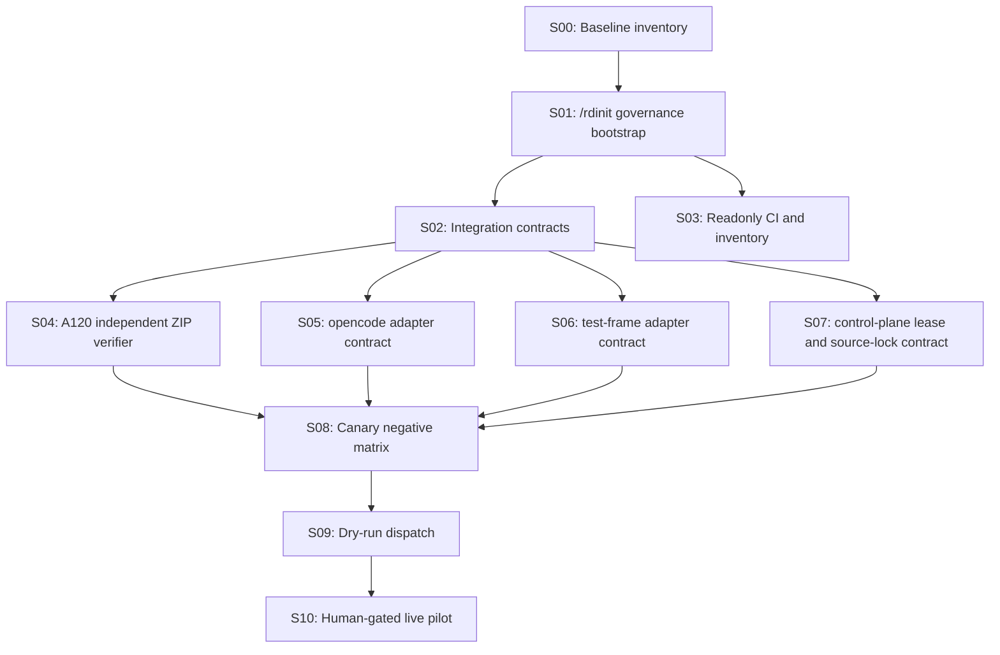

# Minimal Integration DAG v2.1

Date: 2026-06-15

## Serial Dependencies

1. Baseline inventory must precede all runtime discussion.
2. `/rdinit` governance must precede TaskSpec and review contracts.
3. Independent ZIP verification must precede A120 acceptance claims.
4. Dry-run dispatch must precede live runtime.
5. Human authorization must precede live CDP, OpenCode, or external test-frame use.

## Parallel Work

- Integration contracts, readonly CI, and risk register can proceed in parallel.
- ZIP verifier, opencode adapter mapping, test-frame adapter mapping, and
  control-plane lease/source-lock contract can proceed after contracts are stable.
