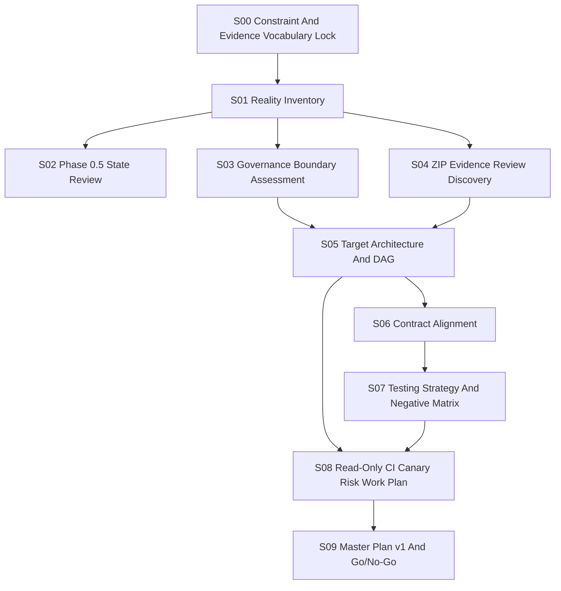

# devframe-system Master Plan v0

Date: 2026-06-15
Scope: parent repository only
Status: parent planning baseline
Runtime: not executed

## 1. Executive Summary

`devframe-system` can continue parent-level integration planning now. It does
not need to wait passively for all submodules to finish.

The current useful work is to lock evidence vocabulary, maintain the reality
inventory, define boundaries, align contracts, design negative checks, and keep
Go/No-Go rules ready for later submodule reports.

Current No-Go items:

- Do not update submodule pins.
- Do not run real Zotero, Obsidian, RAG, WriteLab, MiniApp, browser/CDP, cloud,
  or private paper content.
- Do not call offline candidate, dry-run, dispatch success, ZIP validation, or
  test pass `final_ready`.

Current Go items:

- Maintain parent-only plan and reports.
- Maintain read-only CI/canary design.
- Prepare contract and negative-matrix standards.
- Record submodule evidence as `observed`, `candidate`, or
  `waiting_for_submodule_report` until independently reviewed.

## 2. Reality Inventory

Observed parent state:

| Item | Value |
|---|---|
| Root | `D:\devframe-system` |
| Branch | `codex/rdinit-phase-0-5` |
| Parent dirty state | submodule pointer changes plus parent docs/task specs |
| Latest parent commit | `0ab49dc Pin agent acceptance TaskSpec parser fix` |
| CI file | `.gitlab-ci.yml` exists and is read-only oriented |
| Runtime policy | Phase 0-5 forbids external runtime without explicit authorization |

Observed submodule and lock state:

| Module | Locked commit | Observed worktree HEAD | Status |
|---|---:|---:|---|
| `agent-acceptance` | `3cf2c9b` | `1ae1138` | drift observed; do not pin yet |
| `dev-frame-opencode` | `0c24204` | `e3f628b` | drift observed; offline candidate only |
| `devframe-control-plane` | `7939954` | `7939954` | frozen and aligned |
| `test-frame` | `bdd7b67` | `941819b` | drift observed; waiting for review |

Important evidence paths:

| Path | Meaning |
|---|---|
| `BASELINE_LOCK.json` | current parent baseline lock |
| `integration/lock/submodules.lock.yml` | integration submodule lock |
| `COMPLETION_MATRIX.md` | phase status matrix |
| `INTEGRATION_STATUS.md` | current integration status narrative |
| `RISK_REGISTER.md` | project risk register |
| `integration/reports/a120/a120-evidence-zip-review.md` | A120 ZIP evidence review boundary |
| `.gitlab-ci.yml` | read-only CI definition |
| `integration/runbooks/gitlab-ci-readonly-policy.md` | read-only CI policy |

## 3. Current Integration Status

Phase 0.5 bootstrap is materially present: project rules, runtime docs,
negative fixtures, reports directory, lock files, and read-only CI plan exist.

The parent repo is not in a final integrated state because three submodule
worktree heads are ahead of the lock. That is useful progress, but it is not a
pin decision.

Current status terms:

| Area | Status |
|---|---|
| Parent bootstrap | `verified` |
| Read-only CI design | `verified` as file; runner proof still `human_required` |
| Paper function | `candidate` offline only |
| Test-frame MiniApp real E2E | `blocked` until real environment authorization |
| Agent-acceptance rule center | `observed`; independent review still required |
| Control-plane expansion | `frozen` |

## 4. Boundary Assessment

Parent repository responsibilities:

- Define cross-module contracts.
- Maintain reality inventory and status matrix.
- Maintain evidence vocabulary and fake-green rules.
- Maintain risk register, runbooks, and read-only CI/canary plan.
- Decide whether evidence is sufficient for later pin readiness.

Submodule responsibilities:

- `dev-frame-opencode`: paper-function implementation and offline/live adapter
  boundaries.
- `test-frame`: test orchestration, dry-run, blocked/failed semantics, and
  later positive pilot execution.
- `agent-acceptance`: governance gates, evidence/reviewer/final-verdict
  semantics, and fake-green prevention.
- `devframe-control-plane`: frozen observation of dispatch/control-plane
  contracts only.

Non-equivalence rules:

- Dispatch success is not task success.
- Test pass is not final acceptance.
- ZIP validation is not reviewer acceptance.
- Offline candidate is not live readiness.
- Dry-run ready is not production ready.

## 5. ZIP Assessment

A120 evidence review currently records `PASS_WITH_BOUNDARY`.

That means:

- The A120 evidence path has useful independent review evidence.
- The boundary is limited to the reviewed pack and review criteria.
- It is not a global final acceptance of all A101-A120 evidence.
- It does not authorize copy-forward acceptance, template `ACCEPTED`, or
  reviewer identity bypass.

Current defect conclusion:

| Question | v0 Answer |
|---|---|
| Do reviewed ZIP checks exist? | `YES` for A120 |
| Are all historical packs independently verified? | `UNKNOWN` |
| Are reviewer-side verifier defects fully ruled out? | `UNKNOWN` |
| Is A120 enough for final acceptance? | `NO` |

## 6. Target Architecture

The practical architecture is four layers:

1. Worker modules generate implementation evidence.
2. `test-frame` runs allowed test plans and produces test execution evidence.
3. Reviewer/ZIP mechanisms package and independently inspect evidence.
4. `agent-acceptance` produces governance gates and final verdict boundaries.

`devframe-system` sits above these layers as the parent integration ledger. It
does not replace the worker, test, reviewer, or acceptance layers.

`devframe-control-plane` remains frozen. It may keep contract observation
interfaces, but should not become required for the offline MVP.

## 7. DAG



## 8. Contracts

Contract alignment targets:

| Contract | Parent v0 stance |
|---|---|
| `TaskSpec` | required for delegated work and allowed write scope |
| `DispatchAssignment` | dispatch record only, not success proof |
| `RuntimeAuthorization` | mandatory before live/private/external runtime |
| `WorkerLease` | control-plane observation only for now |
| `SourceLock` | needed before claiming stable source input |
| `ExecutionReport` | worker evidence carrier |
| `TestRunSpec` | test authorization and runtime boundary |
| `TestExecutionReport` | test result carrier, not final acceptance |
| `EvidenceManifest` | required for artifact identity and hashes |
| `ReviewerEvidencePack` | reviewer input pack, not verdict by itself |
| `EvidenceZipReviewReport` | independent ZIP review output |
| `ReviewVerdict` | reviewer decision; still subject to governance |
| `FailureRecord` | required for blocked/failed traceability |
| `AuditEvent` | append-only governance trail target |

Next parent task is to produce a producer/consumer/required-fields/invalid-cases
matrix for these contracts.

## 9. Testing Strategy

Current allowed testing is parent read-only validation:

- inventory commands;
- file existence checks;
- markdown/report consistency checks;
- `git diff --check`;
- CI definition review.

Current forbidden testing:

- real MiniApp E2E;
- live Zotero/Obsidian/RAG/WriteLab;
- browser/CDP/cloud execution;
- package install or dependency mutation;
- submodule pin update as a side effect of tests.

Positive pilots should be prepared as plans now, but run later only after
`RuntimeAuthorization`, redaction, EvidenceManifest, and human gate are present.

## 10. Negative Matrix

P0 negative cases for parent planning:

| ID | Case | Expected result |
|---|---|---|
| NEG-PARENT-001 | offline paper candidate marked `final_ready` | fail |
| NEG-PARENT-002 | dry-run MiniApp evidence marked real E2E pass | fail |
| NEG-PARENT-003 | test pass treated as final acceptance | fail |
| NEG-PARENT-004 | dispatch success treated as implementation success | fail |
| NEG-PARENT-005 | ZIP review treated as global reviewer verdict | fail |
| NEG-PARENT-006 | submodule drift pinned without independent review | fail |
| NEG-PARENT-007 | live adapter run without RuntimeAuthorization | blocked |
| NEG-PARENT-008 | private paper content stored in report | fail |
| NEG-PARENT-009 | missing EvidenceManifest accepted | fail |
| NEG-PARENT-010 | control-plane expansion becomes MVP dependency | fail |

## 11. GitLab Plan

The current GitLab stance is correct: read-only only.

Keep:

- `git status --short --branch`;
- `git submodule status --recursive`;
- `git diff --check`;
- read-only inventory/report scripts after script-safety approval.

Do not add:

- real tests;
- external runtime;
- package install;
- deployment;
- pin mutation;
- automatic final acceptance.

Runner proof remains `HUMAN_REQUIRED` until a real GitLab run artifact is
provided.

## 12. ZIP Verifier Plan

Near-term parent work:

- inventory existing A101-A120 artifact paths;
- list available manifests, hashes, verdicts, and reviewer reports;
- classify each as `verified`, `partial`, `missing`, or `unknown`;
- define independent verifier requirements for path traversal, identity,
  hash recompute, flaky metadata, copy-forward risk, and template verdict risk.

Do not infer that A120 coverage proves every previous pack.

## 13. Roadmap

Parent roadmap:

| Step | Goal | Status |
|---|---|---|
| S00 | constraint and evidence vocabulary | started in v0 |
| S01 | reality inventory | partial v0 |
| S02 | Phase 0.5 state review | partial v0 |
| S03 | boundary assessment | partial v0 |
| S04 | ZIP evidence discovery | partial v0 |
| S05 | architecture and DAG | partial v0 |
| S06 | contract alignment matrix | next |
| S07 | testing strategy and negative matrix | next |
| S08 | CI/canary/risk/serial plan | next |
| S09 | Master Plan v1 Go/No-Go | after submodule reports |

## 14. Risk Register

Top v0 risks:

| Risk | Severity | Mitigation |
|---|---|---|
| Lock vs observed submodule drift | high | record drift; pin only after review |
| Offline candidate promoted too early | high | use candidate vocabulary and negative gates |
| Real/private data leakage | high | require RuntimeAuthorization and redaction |
| Test-frame pass confused with acceptance | high | enforce non-equivalence rules |
| ZIP review over-scoped | high | bind review claims to exact pack paths |
| Control-plane scope creep | medium | keep frozen, observe only |
| Stale `.gitmodules` branch metadata | medium | record mismatch; do not auto-fix |
| CI silently expands beyond read-only | medium | require policy review for CI changes |
| Missing reviewer independence | high | require reviewer identity and evidence chain |
| Script execution ambiguity | medium | keep script-safety record before running scripts |

## 15. Parallel And Serial Work Plan

Parallel now:

- Parent reality inventory.
- Parent contract matrix.
- Parent negative matrix.
- Parent read-only CI/canary plan.
- Parent ZIP review discovery.

Serial later:

- Review submodule reports.
- Decide whether observed heads are pin candidates.
- Update lock files only after main coordinator approval.
- Run real positive pilots only after human authorization.
- Produce Master Plan v1 Go/No-Go.

## 16. Go/No-Go

Current decision:

| Area | Decision |
|---|---|
| Parent S00-S09 planning | `GO` |
| Contract matrix drafting | `GO` |
| Negative matrix drafting | `GO` |
| Read-only CI plan | `GO` |
| Submodule pin update | `NO-GO` |
| Real external runtime | `NO-GO` |
| Final acceptance | `NO-GO` |
| Live paper adapters | `NO-GO` |

## 17. Immediate TaskSpecs

Parent-only next task suggestions:

```text
SUGGESTED_TASK_FOR_DEVFRAME_SYSTEM:
- task_id: DFS-S01-REALITY-INVENTORY-V1
- goal: produce a complete parent reality inventory with lock/observed/drift status.
- allowed files: integration/reports/**, COMPLETION_MATRIX.md, INTEGRATION_STATUS.md
- expected tests: read-only git/file inspection and markdown consistency checks.
- acceptance criteria: every repo/path has evidence source and status vocabulary.
- risk: high
```

```text
SUGGESTED_TASK_FOR_DEVFRAME_SYSTEM:
- task_id: DFS-S06-CONTRACT-ALIGNMENT-V1
- goal: define producer/consumer/required-fields/invalid-cases for core contracts.
- allowed files: integration/contracts/**, docs/agent-runtime/**, integration/reports/**
- expected tests: schema/document cross-reference review only.
- acceptance criteria: every listed contract has owner, consumers, required fields, and invalid examples.
- risk: high
```

```text
SUGGESTED_TASK_FOR_DEVFRAME_SYSTEM:
- task_id: DFS-S07-NEGATIVE-MATRIX-V1
- goal: turn parent fake-green risks into phase-tagged negative cases.
- allowed files: integration/reports/**, docs/agent-runtime/negative-acceptance-tests.md
- expected tests: no runtime; table completeness review.
- acceptance criteria: each negative case has phase, fixture need, expected output, automation level, and runtime_allowed.
- risk: high
```

## 18. Commands Not Run

This v0 report did not run:

- real MiniApp E2E;
- live Zotero, Obsidian, RAG, or WriteLab;
- browser/CDP/cloud runtime;
- package install;
- submodule tests;
- submodule pin updates;
- GitLab runner execution;
- PowerShell project scripts that require script-safety review.

## 19. Human Required Items

Human or main-coordinator approval is required for:

- submodule pin updates;
- real external runtime;
- private paper content access;
- live adapter credentials;
- GitLab runner proof acceptance;
- final acceptance verdict;
- deciding whether control-plane interfaces remain read-only observation or
  become future implementation work.

## 20. Final Recommendation

Proceed with devframe-system parent planning now.

Do not wait for every submodule to finish before continuing parent work. The
parent repo should prepare standards, inventory, contracts, negative matrix,
CI/canary boundaries, and Go/No-Go rules while submodules self-iterate.

When submodule reports return, the parent should align them against this plan,
classify evidence using the locked vocabulary, and only then consider pin
readiness.
