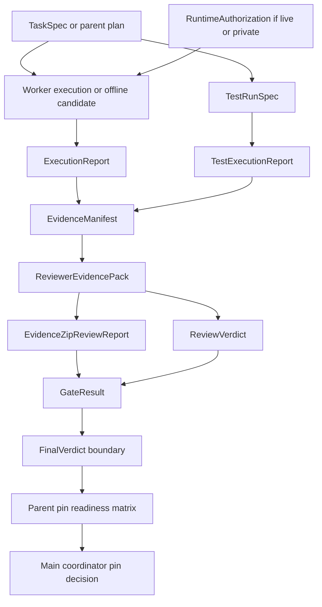
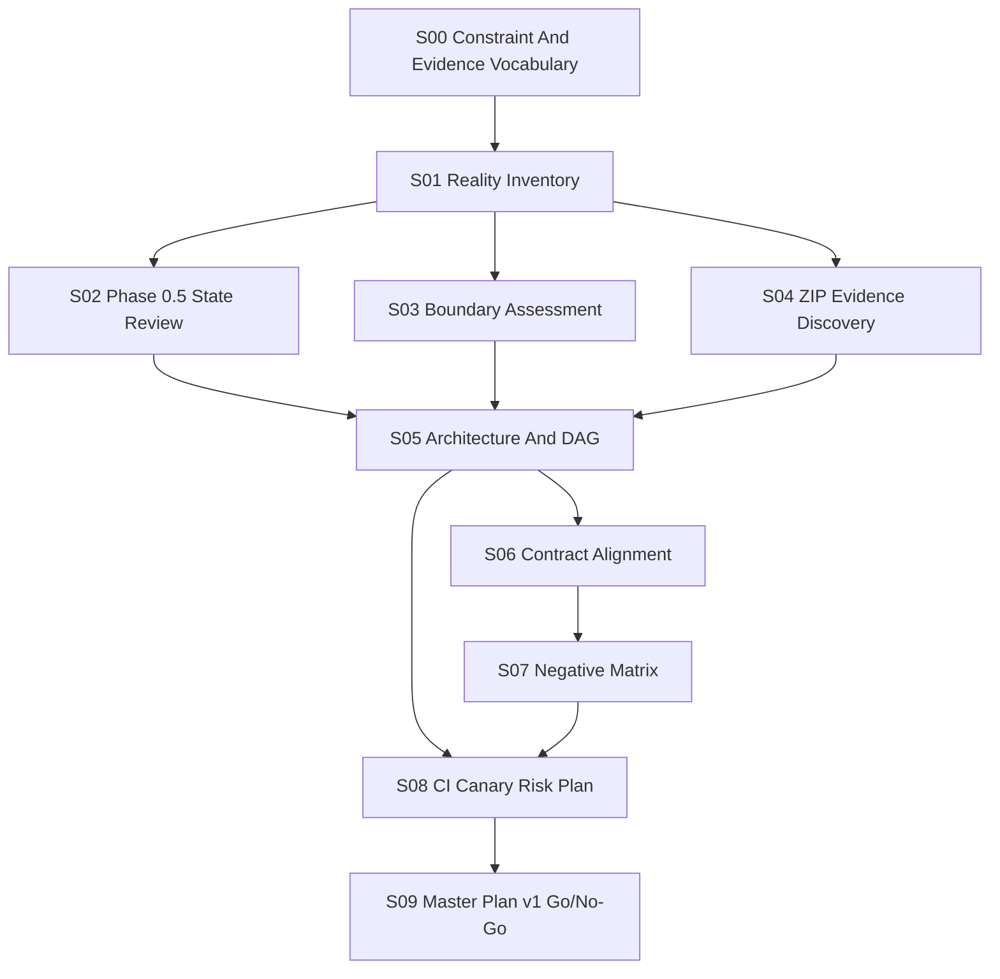

# devframe-system Target Architecture And DAG v1

Date: 2026-06-15
Scope: parent-level architecture and execution DAG
Runtime: not executed
Slice: S05

## 1. Purpose

This report defines the target architecture for a practical devframe-system
toolchain.

The goal is not a perfect platform. The goal is a usable, evidence-backed
workflow where offline candidates, tests, reviews, and final acceptance remain
separate.

## 2. Four-Layer Architecture

| Layer | Owner | Produces | Does not produce |
|---|---|---|---|
| worker layer | `dev-frame-opencode` and other executors | artifacts, diffs, ExecutionReport, candidate outputs | reviewer approval or final acceptance |
| verification layer | `test-frame` | TestRunSpec, TestExecutionReport, dry-run/live blocked semantics | final acceptance |
| review layer | independent reviewer and ZIP verifier | ReviewVerdict, EvidenceZipReviewReport, reviewer pack checks | worker implementation or final governance |
| governance layer | `agent-acceptance` plus human/main coordinator | GateResult, FinalVerdict boundary, fake-green prevention | runtime execution or submodule implementation |

Parent role:

- maintain the ledger and standards;
- compare evidence against contracts;
- recommend Go/No-Go;
- never collapse the layers.

## 3. Control-Plane Position

`devframe-control-plane` stays frozen.

It may provide vocabulary or future contracts for:

- DispatchAssignment;
- WorkerLease;
- SourceLock;
- heartbeat/worker state.

It must not be required for the current offline MVP path.

## 4. Runtime/Data Boundary

Real external data and services require all of:

- RuntimeAuthorization;
- redaction rules;
- EvidenceManifest;
- human gate;
- blocked/failed semantics;
- independent review.

Until those exist, real Zotero, Obsidian, RAG, WriteLab, MiniApp real E2E,
browser/CDP, cloud, and private paper content remain blocked.

## 5. Evidence Flow DAG

## 6. Planning Slice DAG

## 7. Non-Equivalent Success States

| State | Not equivalent to |
|---|---|
| TaskSpec exists | task executed |
| DispatchAssignment exists | task succeeded |
| ExecutionReport pass | reviewer accepted |
| TestExecutionReport pass | final acceptance |
| EvidenceZipReviewReport pass | global evidence accepted |
| ReviewVerdict pass | lock pin approved |
| RuntimeAuthorization exists | run succeeded |
| aligned lock | production ready |

## 8. Practical MVP Shape

The practical usable toolchain needs:

1. offline paper MVP can run on synthetic fixtures;
2. fake-green gates reject candidate/final confusion;
3. test-frame can distinguish dry-run, blocked, failed, and later live pass;
4. parent can see inventory, contract alignment, negative matrix, and pin status;
5. real data/runtime remains human-gated.

## 9. Parent Conclusion

S05 is complete enough for Master Plan v1.

The architecture supports continuing parent planning while submodules
self-iterate. It also prevents a common failure mode: treating a lower-layer
success as final readiness.
